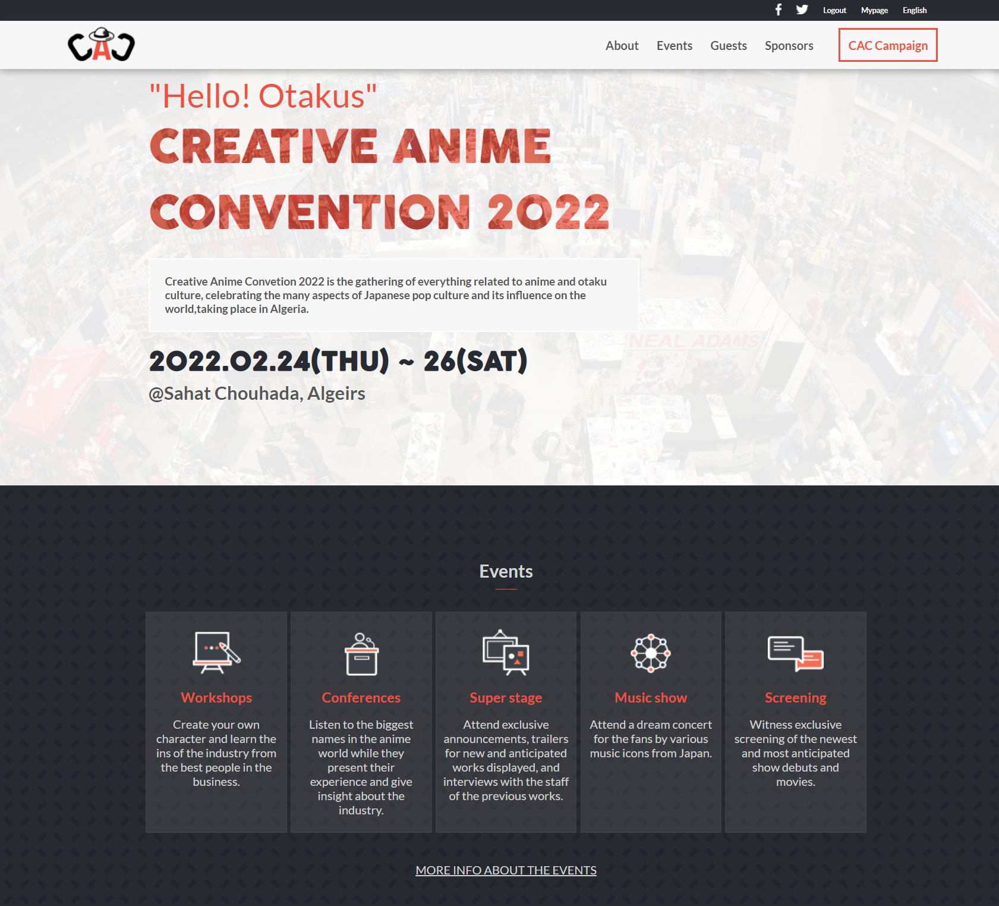

# Portfolio

> This is a website about an event called Creative Anime Convention contains: events, guests and sponsors.

## Live Demo

[Live Demo Link](https://mirouhml.github.io/anime-convention-project/)

## Built With

- HTML
- CSS
- Javascript
- VSCode
- Linters

## Authors

👤 **Mirouhml**

- GitHub: [@mirouhml](https://github.com/mirouhml)
- LinkedIn: [LinkedIn](https://www.linkedin.com/in/ammar-hamlaoui-514909189/)
- Twitter: [@kuronomirou](https://twitter.com/kuronomirou)

## Design 

- Original design idea by [Cindy Shin in Behance](https://www.behance.net/adagio07) 
- [Design Guideline](https://www.behance.net/gallery/29845175/CC-Global-Summit-2015) 

## 🤝 Contributing

Contributions, issues, and feature requests are welcome!

Feel free to check the [issues page](../../issues/).

## Show your support

Give a ⭐️ if you like this project!

## 📝 License

This project is [MIT](./MIT.md) licensed.
